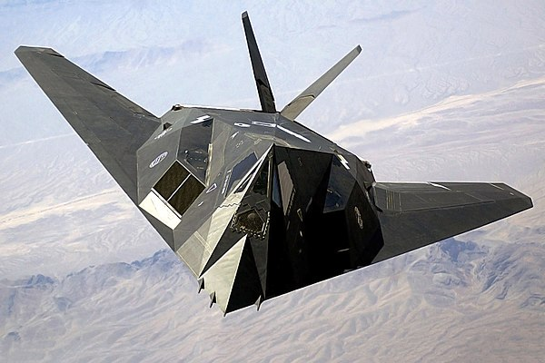

I just finished reading *Skunk Works* by Ben Rich. I enjoyed the book and learned quite a lot about the development of stealth technology during the Cold War.

<!--  -->

For those not aware (as I was not), [Ben Rich](https://en.wikipedia.org/wiki/Ben_Rich) is widely considered to be the father of modern stealth. He took over as the Director of Lockheed Martin's secretive research and development wing called the "Skunk Works" after the retirement of [Kelly Johnson](https://en.wikipedia.org/wiki/Kelly_Johnson_(engineer)), a master aeronautical engineer. Kelly Johnson was responsible for many of the Skunk Works' successes such as the [U2 Spy Plane](https://en.wikipedia.org/wiki/Lockheed_U-2) and its successor, the [SR-71 Blackbird](https://en.wikipedia.org/wiki/Lockheed_SR-71_Blackbird).

### Origin of Stealth ###
One of the most salient stories in my opinion was the origin of the stealth idea. Up till the current time, engineers had been simply doing their best with radar aborbing materials and paints. One day, an engineer working under Ben Rich found an [old paper by Pyotr Yakovlevich Ufimtsev](https://nsarchive2.gwu.edu/NSAEBB/NSAEBB443/docs/area51_10a.PDF), a Russian scientist who had theorized about how to calculate the 'radar cross section' of a given geometry. This was a complete game changer in stealth. Combined with the new computer technology, this allowed engineers at the Skunk Works to numerically design a stealth fighter with minimal radar visibility. By minimal, I mean basically invisible. Up till this point, it seems the paper was given little attention -- despite two of the most powerful nations on planet earth desperately trying to find ways to out-smart each other. This led to the development of the radically different design of the [F-117 Nighthawk](https://en.wikipedia.org/wiki/Lockheed_F-117_Nighthawk) where the angular panels were carefully designed to scatter radar beams. 

<!--  -->

### Ball Bearings and Stealth Fighters ###
I chuckled quite a lot about Rich's stories about convicing hesitant Pentagon officials about the feasiblity of stealth. He remarks that during testing of scale fighter models on state-of-the-art radar ranges they couldn't get good data because the mounts for the models showed up so much larger on radar than the fighter did. Once they spent copious amounts of time and money reducing the radar visibility of the mounts, they finally got data revealing that the design minimizing radar cross section actually worked. The plane model barely showed up on radar (and this was the best radar range in existence). Once they sent this data to the Pentagon, officials thought that the data had been falsified. It was too good to be true. The radar visibility was 3 orders of magnitude smaller than anything previously achieved. 

In response, Ben Rich traveled to the Pentagon and conviced officials that he was not making this up. He brought with him some small steel ball bearings which he rolled across the desk of one official. When asked what these were for, Rich responded with that's what our new fighter will look like on the best radar in the world. Needless to say, Rich's impactful presentation won the Skunk Works a valuable defense contract to work on the F-117 Nighthawk. 

### Lessons Learned ###
I suppose there are various lessons to be learned here. First, in the scientific community there is a great emphasis on novelty. Someone who can claim to be the 'first' at something has a great advantage in getting their work published over those who are not. The same is true in the business world with the concept of 'time to market'. I think this story is a great case study on focusing less on novelty and more on value. Ufimstev beat Rich and his Skunk Works to the idea by almost 10 years, but Ben Rich capitalized on the idea by finding ways to create *value* from the idea. 

Second, presentation matters. Data is important, especially in the scientific community. But Rich and his ball bearings teach us that how it is presented is arguably even more important than the data itself. We should try to present ourselves, our work, and our organizations honestly, concisely, and impactfully. 